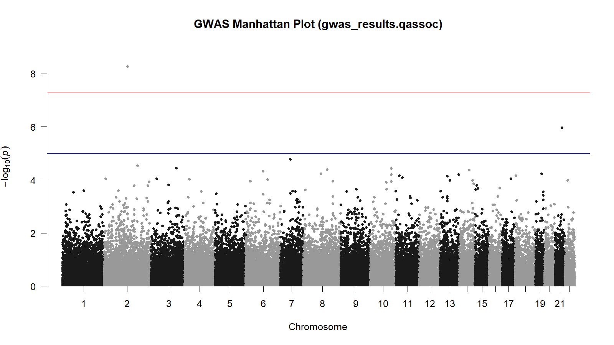
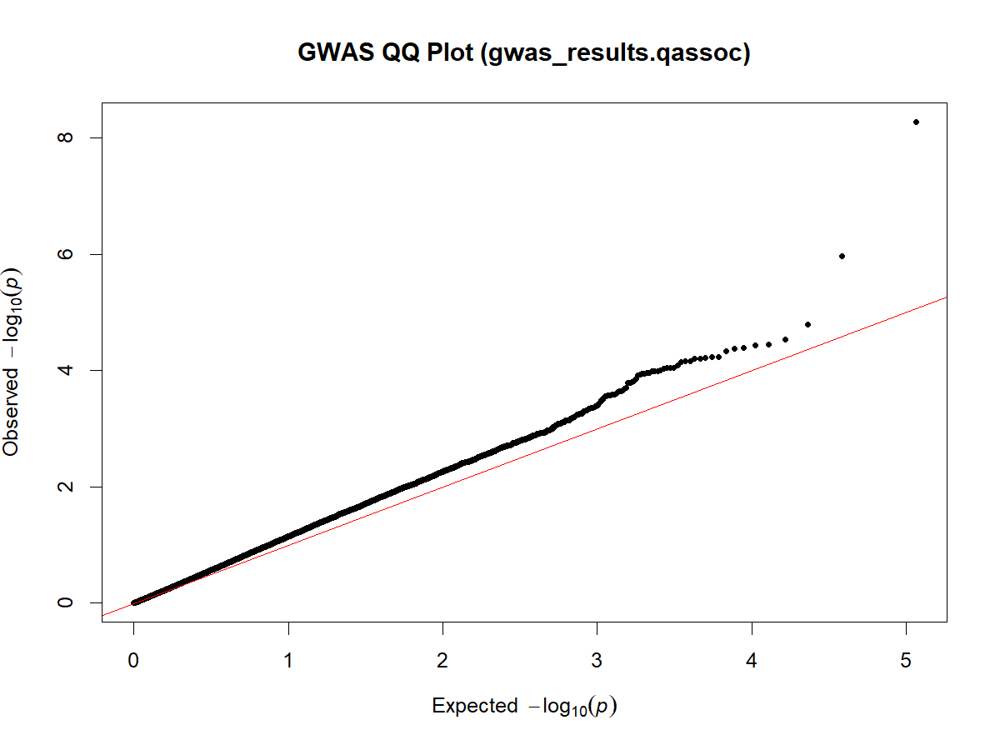

# GWAS Mini Demo (PLINK + R)
An educational pipeline showing how to perform a small Genome-Wide Association Study:
1. Download a test genotype dataset
2. Apply quality control (QC)
3. Run a basic association test
4. Plot Manhattan and QQ plots in R

**Purpose:** demonstrate end-to-end handling of genetic data, from raw genotypes to QC, association testing, and result visualisation, using reproducible scripts and environments.

# Genomic Data Engineering Demo
---

## Overview

This repository demonstrates a **complete miniature GWAS workflow** built with **PLINK**, **R**, **Conda**, and **Make** on a small HapMap example dataset.  
It showcases core bioinformatics engineering principles: scripted automation, version-controlled dependencies, and portable reproducibility.

---

## Project Structure

```bash
genomic_data_engineering_demo/
├── data/
│   ├── raw/          # Downloaded HapMap example files (.ped, .map, .phe)
│   └── processed/    # Binary PLINK data (.bed, .bim, .fam)
├── results/          # GWAS outputs and plots
├── scripts/
│   ├── 01_download_data.sh
│   ├── 02_qc_and_assoc.sh
│   └── 03_visualize.R
├── environment.yml   # Conda environment specification
├── Makefile          # Workflow automation
└── README.md
```


## Requirements

### 1. Software
- **VS code** (optional IDE)
- **Conda** or **Miniconda**
- **PLINK v1.9+** (`plink` or `plink.exe`)
- **GNU Make** (installed automatically via Conda)
- **R (≥4.0)** with packages:  
  `data.table`, `qqman`
  ```bash
  R -q -e 'install.packages(c("data.table","qqman"), repos="https://cloud.r-project.org")'

### 2️ Create the Environment

```bash

conda env create -f environment.yml
conda activate bio-demo
```

### 3. Running the Demo
Option A- One-command pipeline (preferred)

```bash
make
```

What the script does 
Step 1:  Download Data

bash scripts/01_download_data.sh


Downloads and unzips a small HapMap subset (human genotype data) into data/raw/.

Step 2:   Quality Control + Association


bash scripts/02_qc_and_assoc.sh


Performs:

PED/MAP → binary conversion

Basic QC filters (--geno 0.05 --mind 0.05 --maf 0.05)

Simple quantitative association using the phenotype qt.phe.

Result file:

results/gwas_results.qassoc

Step 3:  Visualisation
Rscript scripts/03_visualize.R

Creates:

results/manhattan.png

results/qqplot.pngStep 

Option B- Manual execution
``` bash
bash scripts/01_download_data.sh
bash scripts/02_qc_and_assoc.sh
Rscript scripts/03_visualize.R
```

### 4. Output files
results/gwas_results.qassoc :	Association results (CHR, SNP, BETA, P)

results/manhattan.png :	Manhattan plot of –log₁₀(p) per chromosome

results/qqplot.png : QQ plot comparing observed vs expected p-values

Example top hit:
| CHR | SNP       | BP    | BETA   | P-value  |
| --- | --------- | ----- | ------ | -------- |
| 2   | rs2222162 | 10602 | -1.729 | 5.27e-09 |

Manhattan plot:


QQPlot:


### What I Learned

PLINK basics: converting text genotype data to binary format for efficiency.

Quality control filters to remove low-quality SNPs and samples.

Association testing (--assoc) for continuous traits.

Genome-wide significance threshold (5×10⁻⁸) and its interpretation.

Manhattan and QQ plots for visualising association results.

Interpreting GWAS outputs, effect size (BETA), direction, and p-values.

End-to-end reproducible bioinformatics scripting with Bash + R.

### 5. Interpretation
This miniature dataset (89 samples, ~57k SNPs) is for demonstration only.
One SNP (rs2222162 on chr2, p = 5.27×10⁻⁹) passed the genome-wide threshold, illustrating how significant loci appear in GWAS plots.
In real studies, such signals require replication, population stratification checks, and biological interpretation.

Reproduce Everything (from scratch)

```bash
git clone https://github.com/jayashreer067/genomic_data_engineering_demo.git


cd genomic_data_engineering_demo
conda activate bio-demo
make
```
Author: Jayashree Ravi Shetty
Last Updated: October 2025